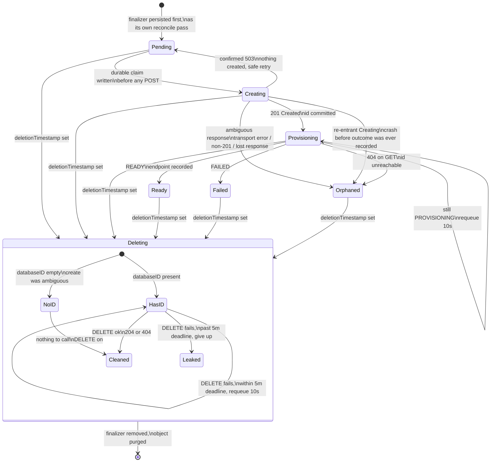

# ManagedDatabase reconcile state machine

Drawn from `internal/controller/manageddatabase.go`. Every arrow is a decision
one `Reconcile` call commits to on its own — no hidden retries, no cross-call
memory beyond what's written to `status`.

Every terminal state (`Ready`, `Failed`, `Orphaned`) is absorbing on the
create/poll side — `Reconcile`'s own top-level switch returns before ever
reaching `reconcileCreate` again. Deletion is the one transition reachable
from every state, since `Reconcile` checks `DeletionTimestamp` before
anything else.

## States

| State | Meaning | Terminal | Set by |
|---|---|---|---|
| `Pending` (or empty) | No create attempted yet, or rolled back after a confirmed 503 | No | `reconcileCreate` |
| `Creating` | A create request may be in flight; the durable claim is written before the POST | No | `reconcileCreate` |
| `Provisioning` | External database exists; polling by id until `READY` or `FAILED` | No | `reconcilePoll` |
| `Ready` | `READY`; endpoint recorded in status | Yes | `reconcilePoll` |
| `Failed` | External provisioning ended in `FAILED` | Yes | `reconcilePoll` |
| `Orphaned` | Create outcome unknown, or the database became unreachable — needs a human | Yes | `reconcileCreate` / `reconcilePoll` |

## Why every ambiguous path fails closed to `Orphaned`

Two things about the provisioning API make this unavoidable: `POST` isn't
idempotent, and a successful create's response can be lost. Once a create's
outcome is anything other than a clean `201` or a confirmed `503`, the
controller can no longer tell "nothing happened" from "it worked and I
didn't hear back" — and retrying under that uncertainty risks a second
database, which nothing is allowed to do.

The fail-closed choice: never retry an ambiguous create. The cost is real —
some genuinely successful creates end up `Orphaned` with no automatic
recovery — but it's the only policy that holds the one hard guarantee, even
across a crash landing exactly between the pre-POST claim and the POST's
outcome.
